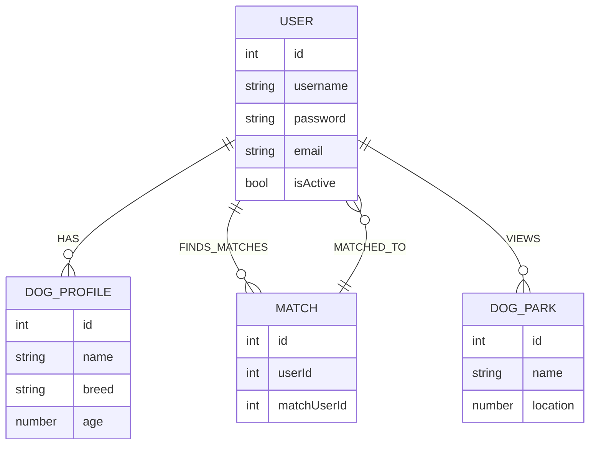

# PlayPal

- **Contributors:** Yuna Pahk, Isaac Asher, Haleh Bozorgnia, and Nyijia Morgan
- [**Backend**](https://github.com/yunapahk/Group-Project/tree/main/backend)
- [**Deployed Site**](https://bookmarkd-504g.onrender.com)
- **Languages, Database, and Frameworks Used:** React, Express, Node, MongoDB, SASS, EJS, JSX, Javascript
- [**Trello**](https://trello.com/b/dVAobCJu/bookmarkd)

## Description

PlayPal takes the guesswork out of planning playdates for your canine companions. With intuitive matching based on your dog's unique characteristics and needs, PlayPal creates a community of like-minded dog lovers. By connecting dog owners with each other and valuable local resources, PawMate makes it simple to plan, locate, and enjoy fun and safe playdates.

Whether you're a proud puppy parent seeking socialization opportunities or an experienced dog owner looking for new friends for your loyal companion, PlayPal is your go-to app for everything dog-related. Connect, play, and enjoy with PlayPal, your dog's new best friend is just a swipe away.

Join the PlayPal community today and make every play date a tail-wagging success!

## Features 🐕
Find your perfect match! Swipe left or right to browse through profiles of dogs near you. Match with those that suit your dog's breed, energy level, and play preferences.

- Location-Aware Matching: PlayPal considers proximity to local dog parks in matching, ensuring that your playdates are not only compatible but conveniently located.

- Real-Time Dog Park Popularity: Wondering how crowded the local dog park is? PlayPal provides live updates on the number of people at nearby parks, so you can pick the perfect time for a visit.

- Closest Dog Park Locator: Don't know where the nearest dog park is? PlayPal's integrated map feature will guide you to the closest dog-friendly locations.

- In-App Chat: Found a match? Chat with other dog owners within the app to coordinate playdates, discuss your dogs' preferences, and more.

- User Profiles: Create detailed profiles for your dogs, including breed, age, energy level, and more, to ensure a perfect match.

## Mock UP of UI
***Authn Page***

***Match Page***

***Dog Park Page***

## List of Backend Endpoints

| ROUTE NAME | ENDPOINT | METHOD | PURPOSE |
|------------|----------|--------|---------|
| Index | /dog | GET | Display list dog matches |
| Create | /user/signup | POST |  Creates a profile for the user |
| Create | /dog/signup | POST |  Creates a profile for user's dog |
| Update/Edit | /user/edit | PUT | Update/Edit dog's info |
| Update/Edit | /dog/edit | PUT | Update/Edit dog's info |
| Show | /dog/:id | GET | Display's card stack of potential dogs to match with |
| Destroy | /user/delete | DELETE | Deletes user |
| Destroy | /dog/delete | DELETE | Deletes dog |
   
## ERD (ENTITY RELATIONSHIP DIAGRAM)

